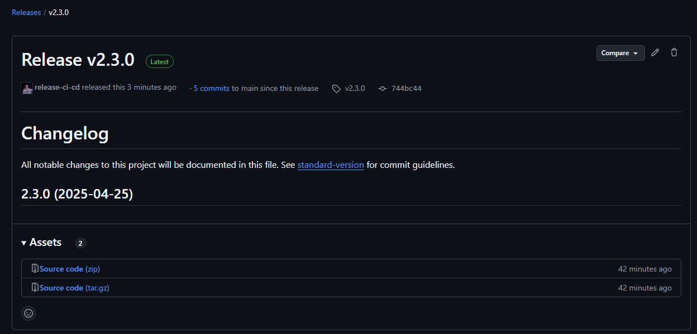

# 📦 Rapport Comparatif : Outils de Release Automatisée

## 🧪 Liste des outils testés

- `standard-version`
- `semantic-release`

---

## ⚖️ Forces & Faiblesses

### 1. `standard-version`

**Forces :**
- Simple à intégrer dans un script bash.
- Contrôle manuel sur le bump (major, minor, patch).
- Génère automatiquement le `CHANGELOG.md`.
- Facile à comprendre et à personnaliser.

**Faiblesses :**
- Ne publie pas la release sur GitHub sans script additionnel.
- Ne crée pas de release npm ou GitHub automatiquement (nécessite `gh` CLI ou autre).
- Moins adapté à une CI/CD 100% automatisée.

---

### 2. `semantic-release`

**Forces :**
- Release totalement automatisée basée sur les commits (format Conventional Commits).
- Crée changelog, tag Git, publication GitHub, npm, etc.
- Parfait pour une intégration CI/CD sans interaction manuelle.

**Faiblesses :**
- Courbe d’apprentissage plus élevée.
- Peut être trop "magique" (moins de contrôle manuel).
- Nécessite une stricte convention de commit.

---

## 📸 Captures d’écran / Liens vers les releases

### 🔗 Lien vers une release générée avec `standard-version` :
[Release v2.3.0](https://github.com/Projet-CI-CD/API/releases/tag/v2.3.0)

> *(Inclut un changelog généré manuellement + tag Git)*

---

## ✅ Conclusion

- `standard-version` est idéal pour un processus semi-automatisé où l’on garde la main sur le bump et le changelog.
- `semantic-release` est recommandé si tu veux un pipeline full-auto basé uniquement sur les commits.

